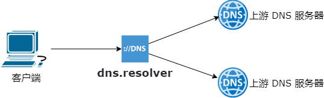

## **✨ dns.resolver ✨**

一个缓存优先的 DNS 解析程序，可以在 Windows、Linux 和 macOS 中运行，用作本地或局域网 DNS 服务器。

> 如果你喜欢或觉得有用，就给它一个 GitHub Star 。

## **1. 拓扑结构**

<p align="center"></p>

## **2. 主要功效**

- **加速客户端响应**
  * 缓存命中时立即返回响应结果，不必每次都请求上游服务器；开发环境缓存命中测试，耗时接近 0 值。
  * 与互联网相比，局域网一般带宽更高、响应时间更短。

- **提升安全性和隐私性**
  * 支持 DoH (DNS over HTTPS) 协议访问上游服务器。
  * 基于行业通用的 HTTPS 安全协议，请求和响应在传输过程中是对称加密的，可有效防止第三方监视和篡改，从此告别 DNS 劫持和污染。

- **自定义域名解析**【待实现】
  * 基于用户配置，自定义特定域名的 DNS 响应结果。
  * 支持 A、AAAA、CName、MX 等常见记录类型。

- **拦截广告、跟踪、恶意软件、钓鱼或欺诈域名等**【待实现】
  * 基于规则进行判断，命中时返回 NxDomain 状态码。
  * 规则清单可通过互联网进行刷新。

## **3. 安装运行**

- 下载应用压缩包并解压。
- 复制一份 ` appsettings.sample.json ` 文件，重命名为 ` appsettings.json ` 。
- 根据需要修改 ` appsettings.json ` 中的配置信息。
- 根据需要打开防火墙，允许应用通过防火墙，或放开 ` appsettings.json ` 中 ` dns/local/bind ` 配置的本地侦听端口，默认为 ` 53 ` 。
- 根据需要赋予运行权限。

### **3.1. 直接运行**

在 windows、Linux 和 macOS 中直接双击打开运行应用程序，或在命令行中运行应用程序。

> 应用显示 `Running... Press <enter> key to exit.` 提示信息。

在试用的时候，可以先尝试此方式。

### **3.2. 任务计划**

以 windows 为例：

> - 触发器页签点击 `新建` 按钮；`开始任务` 选择 `启动时`；<br />根据需要设置 `延迟任务时间`，实现启动一段时间后启动。
> - 操作页签点击 `新建` 按钮；`操作` 选择 `启动程序`；设置 `程序或脚本` 为应用全路径，如`C:\CachedNameResolver\cnr.exe`；`起始于` 设置为 `C:\CachedNameResolver`。
> - 条件页签，根据需要选择去除 `只有在计算机使用交流电源时才启动此任务` 选项。
> - 设置页签，根据需要选择去除 `如果任务运行时间超过以下时间，停止任务` 选项。
> - 点击 `确定` 按钮，输入用户名和密码后，保存任务。

## **4. 用作本地或局域网 DNS 服务器**

**4.1. 修改配置**

- 在 appsettings.json 文件中，将 dns/local/bind 设为 ` [ "127.0.0.1" ] ` 、 ` [ "A.B.C.D" ] ` ( IPv4 ) 或 ` [ "::1" ] ` 、 ` [ "A:B:C:D:E:F:G:H" ] ` ( IPv6 )，其中：
  * ` A.B.C.D ` 为本地网络连接的局域网 IPv4 地址 。
  * ` A:B:C:D:E:F:G:H ` 为本地网络连接的局域网 IPv6 地址 。

    > IPv6 局域网地址段 ( Unique Local Address，ULA ) 为 ` FC00::/7 ` ，详见 [ ` RFC4193 ` ](https://www.rfc-editor.org/rfc/rfc4193.html)。

**4.2. 验证 DNS 响应**【可选】

- 在 windows 命令行中可输入 ` nslookup github.com server ` 。

- 在 linux 命令行中可输入 ` dig github.com @server ` 。

**4.3. 修改操作系统设置**

- 将本地 DNS 服务器地址改为 ` 127.0.0.1 ` 、 ` A.B.C.D ` ( IPv4 ) 或 ` ::1 ` 、 ` A:B:C:D:E:F:G:H ` ( IPv6 ) 。

## **5. 配置文件说明**

配置文件 appsettings.json 位于 cnr.exe 相同的文件夹下。

### **5.1. 样例**

采用 JSON 格式，如下所示：

> ```
> {
>   "dns": {
>     "local": {
>       "bind": [ "udp://127.0.0.1:53", "udp://A.B.C.D:53" ],
>       "timeout": 1000
>     },
>     "upstream": {
>       "server": [ "https://223.5.5.5/dns-query", "https://223.6.6.6/dns-query",
>                   "[name.lan]udp://A1.B1.C1.D1:5353" ], "[name.lan]udp://A2.B2.C2.D2:5353" ]
>       "mode": "any",
>       "timeout": 2000
>     },
>     "cache": {
>       "timeout": 600000,
>       "refreshOnCall": false
>     }
>   }
> }
> ```

### **5.2. dns 配置节**

DNS 相关配置的根节点。

#### **5.2.1. dns/local 配置节**

DNS 本地配置信息。

- **bind：本地绑定信息。**

  * 每个元素采用` “ 协议 + IP 地址 + 端口号 ” `的形式。
  * 当前支持 ` udp ` 和 ` tcp ` 协议；如无特殊需要，建议只开放 ` udp ` 协议即可，性能和兼容性都很好。
  * 未指定时，端口号默认为 ` 53 ` 。
  * 支持多个绑定，中间用英文逗号分隔。
  * 每个地址都必须是运行环境本地存在的 IP 地址。

- **timeout**

  * 客户端访问本应用，单次交互接收数据和发送数据的超时时间，单位：毫秒。

#### **5.2.2. dns/upstream 配置节**

DNS 上游服务器配置信息。

- **server**

  * 上游服务器信息。
  * 每个元素采用` “限定域名 + 协议 + IP 地址 + 端口号” `的形式。
    + ` 限定域名 `在方括号中间，可选，为空时纳入默认上游服务器列表。
    + 当前支持 ` udp ` 、 ` tcp ` 和 ` https ` 协议；可根据个人需要进行配置。
    + 采用 ` IP 地址 ` 配置上游服务器，可有效避免域名解析为跨运营商网络 IP 地址带来的性能波动。
  * 支持多个上游服务器，中间用英文逗号分隔。

- **mode**

  * 缓存未命中时，同时访问多个上游服务器的取值模式，有 any 和 all 两个可选项。
    + any : 任一上游服务器返回结果就继续处理；其他上游服务器在后台继续处理。`【建议选用】`
    + all : 全部上游服务器都返回结果后，继续处理。

    > 两种模式最终都会合并上游服务器的全部响应结果，去重后存储到缓存中。

- **timeout**

  * 本应用访问上游服务器，单次交互接收数据和发送数据的超时时间，单位：毫秒。

#### **5.2.3. dns/cache 配置节**

缓存上游服务器解析结果的配置信息。

- **timeout**

  * 缓存数据保持有效的超时时间，单位：毫秒。

- **refreshOnCall**

  * 在缓存有效期内，每次客户端请求，立即返回缓存中的解析结果。
  * 当 refreshOnCall = true 时，继续在后台采用 all 模式请求上游服务器，并刷新缓存内容。

## **6. 已知的公共 DNS 服务器**

- **DNSPod（腾讯）**

|      协议      |            地址                  |
| :------------: | :------------------------------: |
| DNS, IPv4      | `udp://119.29.29.29:53`          |
| DNS, IPv4      | `udp://119.28.28.28:53`          |
| DNS, IPv6      | `udp://[2402:4e00::]:53`         |
| DNS-over-HTTPS | `https://1.12.12.12/dns-query`   |
| DNS-over-HTTPS | `https://120.53.53.53/dns-query` |
| DNS-over-HTTPS | `https://doh.pub/dns-query`      |
| DNS-over-HTTPS | `https://dns.pub/dns-query`      |
<!-- | DNS-over-TLS   | `tls://dot.pub`                   | -->

- **Alidns（阿里巴巴）**

|      协议      |              地址                  |
| :------------: | :--------------------------------: |
| DNS, IPv4      | `udp://223.5.5.5:53`               |
| DNS, IPv4      | `udp://223.6.6.6:53`               |
| DNS, IPv6      | `udp://[2400:3200::1]:53`          |
| DNS, IPv6      | `udp://[2400:3200:baba::1]:53`     |
| DNS-over-HTTPS | `https://223.5.5.5/dns-query`      |
| DNS-over-HTTPS | `https://223.6.6.6/dns-query`      |
| DNS-over-HTTPS | `https://dns.alidns.com/dns-query` |
<!-- | DNS-over-TLS   | `tls://dns.alidns.com`                 | -->

- **360安全DNS**

|      协议      |                     地址                       |
| :------------: | :--------------------------------------------: |
| DNS, IPv4（电信/铁通/移动） | `udp://101.226.4.6:53`            |
| DNS, IPv4（电信/铁通/移动） | `udp://218.30.118.6:53`           |
| DNS, IPv4（联通）           | `udp://123.125.81.6:53`           |
| DNS, IPv4（联通）           | `udp://140.207.198.6:53`          |
| DNS-over-HTTPS（联通）      | `https://123.125.81.6/dns-query`  |
| DNS-over-HTTPS（联通）      | `https://140.207.198.6/dns-query` |
| DNS-over-HTTPS              | `https://doh.360.cn/dns-query`    |
<!-- | DNS-over-TLS                | `tls://dot.360.cn`                 | -->

## **7. 赞助**

您的支持，是我的动力，更是 CachedNameResolver 可以获得长期运维的保障，谢谢！

<table border="0" cellspacing="0" cellPadding="0" style="border:0">
<tr>
  <td> &nbsp; &nbsp; &nbsp; &nbsp; &nbsp; &nbsp; &nbsp; &nbsp; &nbsp; &nbsp;</td>
  <td> &nbsp; &nbsp; &nbsp; &nbsp; &nbsp; &nbsp; &nbsp; &nbsp; &nbsp; &nbsp;</td>
</tr>
<tr>
  <td align="center">用支付宝赞助</td>
  <td align="center">用微信支付赞助</td>
</tr>
</table>